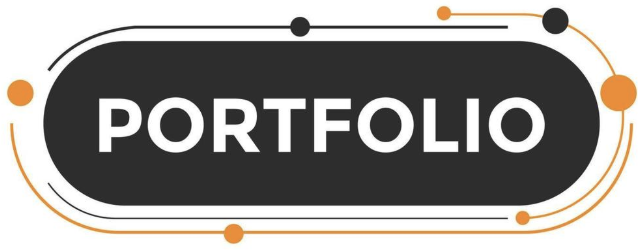

<h1 align="center"></h1>
<h3 align="center">🔥 Developer | Learner | Building Amazing Things</h3>

---

  
Hi, I’m **Vortex** — a passionate learner, developer, and creator who loves turning ideas into meaningful digital experiences. My journey in technology is driven by curiosity and the desire to understand how things work, whether it’s building AI-powered tools, developing modern web applications, or experimenting with new programming concepts. I enjoy diving deep into different technologies, exploring their possibilities, and discovering how they can be combined to build something innovative and useful.

What excites me most about development is the process of solving problems through clean, efficient, and purposeful code. Every project I work on is an opportunity to learn something new, refine my skills, and challenge myself creatively. I believe that great software is not just about functionality, but also about clarity, structure, and the experience it delivers to people who use it.

Whether I’m designing a small utility, working on a full-scale application, or experimenting with a new framework, I’m always focused on growth and improvement. My goal is to keep expanding my knowledge, build impactful digital products, and contribute to the tech community by sharing ideas, learning openly, and creating projects that inspire others.

---

## 🌱 Currently Learning  
- Web Development  
- Artificial Intelligence  
- System Programming  

---

# 💻 Tech Stack:
     

---

## 💻 Interests  
- Frontend & Backend Development  
- Rust, Python, C++, Java  
- AI Tools  
- Game Development (Chess AI, Web Tools)

---

**Languages:**  
`Python` · `HTML` · `CSS` · `JavaScript` · `Java`  

**Tools:**  
`VS Code` · `Git` · `MacOS`  

---

## 🚀 Projects I'm Building  
- 🌐 My Portfolio Website  
- ♟️ Chess AI Game  
- 🔧 Web Tools & Experiments  

---

 
 

---

## 🔗 Connect With Me  
- GitHub: **[@Vortex-macos](https://github.com/Vortex-macos)**  

---

## 🧩 Logo  

  

---

# [My Websites]

 

 

---

## 📨 Feedback  
If you have any feedback, feel free to reach out!
Gmail: codeyaipro@gmail.com

